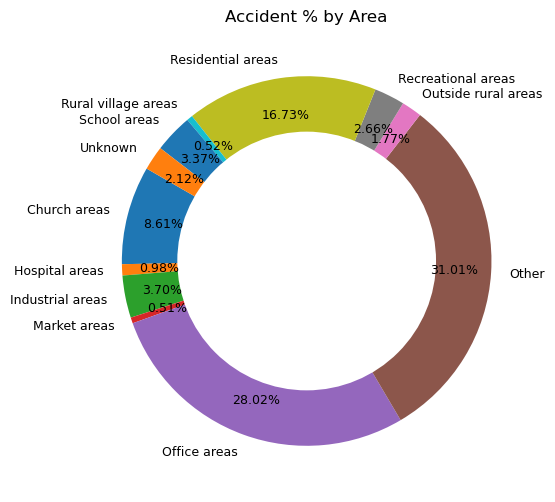
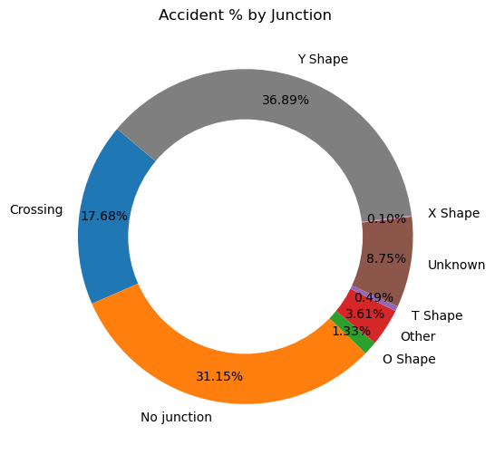

# Road-Accidents-Analysis

## Insights
- Friday experiences the highest number of accidents (2041), whereas Sunday records the lowest number of accidents (1467).

- The highest number of accidents occurs between 17:00 and 17:59.
- More than 50% of the accidents occur in just three types of locations: office areas, residential areas, and church areas.

- Market areas have the highest average casualties (1.76), suggesting higher risks due to congestion or increased activity levels.

- Snowy conditions pose the highest risk for accidents with multiple casualties, despite having fewer total accidents. 

- Just three junction types—Crossing, No Junction, and Y-Shape Junction—contribute to approximately 75% of the total accidents.

