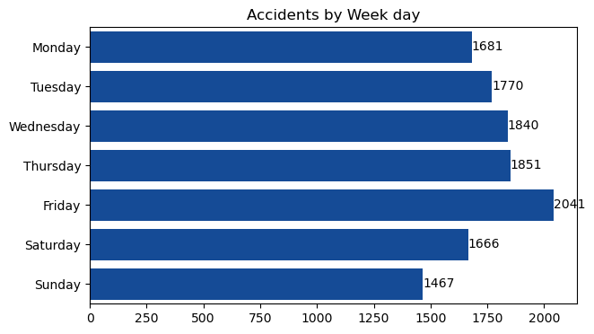
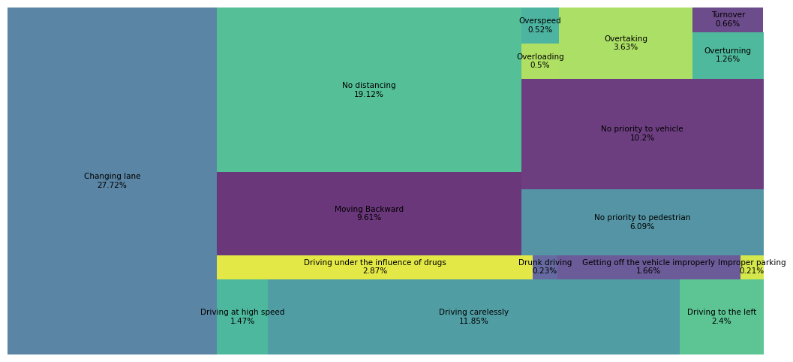

# Road-Accidents-Analysis

## Project Overview
Road accidents continue to be a significant public safety concern, with numerous factors contributing to their frequency and severity and understanding the root causes and identifying high-risk areas remain challenges for policymakers and urban planners.
This project provides a comprehensive analysis of road accidents to uncover key patterns, risk factors, and critical insights that contribute to accident frequency and severity. Project involves cleaning, analyzing, and visualizing road accident records collected from the police departments of Addis Ababa Sub-Cities for the years 2017 to 2020. The analysis aims to identify high-risk areas, junction types, road conditions, and behavioral patterns associated with accidents.

## Tools and Technologies
- __Jupyter Notebook__ : For coding and data visualization.
- __Pandas__ : For data manipulation and analysis.
- __Matplotlib__ : For creating visualizations.
- __Seaborn__ : For enhanced statistical data visualization.

## Data Cleaning
- Removed approximately 10 unnecessary columns, including 'Vehicle_driver_relation,' 'Fitness_of_Casualty,' 'Owner_of_vehicle,' and others, to streamline the dataset.
- Removed duplicates rows in the dataset.
- Checked each column for null and inconsistent values, then replaced the null values with 'Unknown' or 'Other' as appropriate.
- Checked and corrected the data types of the columns where necessary.
- Checked for outliers in the numerical columns.

## Analysis and Insights

### 1. Overview of Accident Frequency
- Friday experiences the highest number of accidents (2041), whereas Sunday records the lowest number of accidents (1467).

- The highest number of accidents occurs between 17:00 and 17:59.

___
### 2. Key Locations of Accidents

- More than 50% of the accidents occur in just three types of locations: office areas, residential areas, and church areas.

- Market areas have the highest average casualties (1.76), suggesting higher risks due to congestion or increased activity levels.

___
### 3. Junction Types and Risks

- Just three junction types—Crossing, No Junction, and Y-Shape Junction—contribute to approximately 75% of the total accidents.

- No junctions and Y-shaped junctions account for the highest number of accidents and casualties, while O-shaped and T-shaped junctions have relatively fewer accidents and a lower percentage of casualties involving more than one person.

___
### 4. Road Types and Safety

- Two-way (divided with broken lines) has a much higher accident frequency (35.82%) compared to two-way (divided with solid lines), which has a significantly lower accident rate (1.15%), suggesting that broken line roads are riskier and potentially less safe.

___
### 5. Causes of Accidents

- Changing Lane, No distancing, Driving carelessly, No priority to vehicle and Moving Backward are the major reasons for accidents.

- Changing lanes is the leading cause of accidents in all three major areas where the majority of accidents occur.

___
### 6. Vehicle-Specific Observations

- Turbo vehicles have the highest percentage of accidents involving more than one death, despite having relatively few overall cases. On the other hand, public vehicles with more than 45 seats show the lowest percentage of such severe accidents, which is unexpectedly low.
  
___
### 7. Weather Conditions and Risks

- Snowy conditions pose the highest risk for accidents with multiple casualties, despite having fewer total accidents.

## Recommendations
- Focus safety awareness programs on Fridays and during peak hours (17:00–17:59) to address the high accident frequency.
- Improve road signage and lighting at office areas, residential areas, and church areas to reduce accidents in these high-risk locations.
- Prioritize safety interventions at Crossing, No Junction, and Y-Shape Junctions, as they account for 75% of total accidents.
- Consider redesigning or improving safety at O-shaped and T-shaped junctions to further minimize casualties.
- Reevaluate the use of broken lines on two-way roads, which show significantly higher accident frequencies, and consider implementing solid lines or stricter lane discipline measures.
- Address major accident causes such as Changing Lane, No Distancing, and Driving Carelessly through stricter enforcement and driver education programs.
- Investigate the reasons behind Turbo vehicles' higher accident severity and implement stricter safety regulations for these vehicles.
- Increase road safety measures during snowy conditions, such as mandatory winter tires and reduced speed limits, to mitigate the higher risk of multi-casualty accidents.

